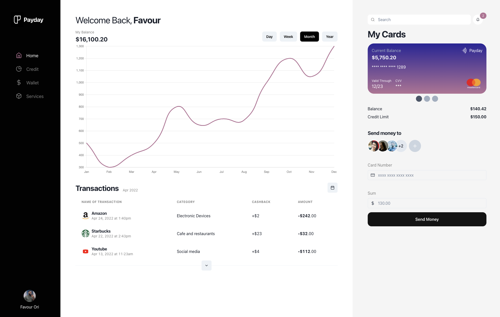

# Next | Chakra | Dashboard | Payday Concept

Built using:

| Name                  | Version | Website/Documentation                                   |
| --------------------- | ------- | ------------------------------------------------------- |
| Chakra-UI             | 2.5.1   | https://chakra-ui.com/                                  |
| ChartJS               | 4.2.1   | https://www.chartjs.org/docs/master/                    |
| React Icons (Feather) | 4.7.1   | https://react-icons.github.io/react-icons/icons?name=fi |
| Next.js               | 13.1.6  | https://nextjs.org/docs/getting-started                 |
| React ChartJS 2       | 5.2.0   | http://reactchartjs.github.io/react-chartjs-2/#/        |

The design: https://dribbble.com/shots/15640240-The-Rise-dashboard-activity

# Result

## 

This is a [Next.js](https://nextjs.org/) project bootstrapped with [`create-next-app`](https://github.com/vercel/next.js/tree/canary/packages/create-next-app).

## Getting Started

First, run the development server:

```bash
npm run dev
# or
yarn dev
# or
pnpm dev
```

Open [http://localhost:3000](http://localhost:3000) with your browser to see the result.

You can start editing the page by modifying `pages/index.js`. The page auto-updates as you edit the file.

[API routes](https://nextjs.org/docs/api-routes/introduction) can be accessed on [http://localhost:3000/api/hello](http://localhost:3000/api/hello). This endpoint can be edited in `pages/api/hello.js`.

The `pages/api` directory is mapped to `/api/*`. Files in this directory are treated as [API routes](https://nextjs.org/docs/api-routes/introduction) instead of React pages.

This project uses [`next/font`](https://nextjs.org/docs/basic-features/font-optimization) to automatically optimize and load Inter, a custom Google Font.

## Learn More

To learn more about Next.js, take a look at the following resources:

- [Next.js Documentation](https://nextjs.org/docs) - learn about Next.js features and API.
- [Learn Next.js](https://nextjs.org/learn) - an interactive Next.js tutorial.

You can check out [the Next.js GitHub repository](https://github.com/vercel/next.js/) - your feedback and contributions are welcome!

## Deploy on Vercel

The easiest way to deploy your Next.js app is to use the [Vercel Platform](https://vercel.com/new?utm_medium=default-template&filter=next.js&utm_source=create-next-app&utm_campaign=create-next-app-readme) from the creators of Next.js.

Check out our [Next.js deployment documentation](https://nextjs.org/docs/deployment) for more details.
